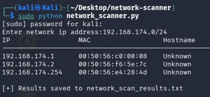
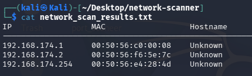

# Network Scanner Using Python

A multithreaded Network Scanner developed using Python and Scapy for detecting active devices in a network using ARP requests. The tool identifies IP addresses, MAC addresses, and hostnames of connected devices and saves the scan results into a text file.

---

# Features

- ARP-based device discovery
- Detects active hosts in a network
- Displays IP addresses
- Retrieves MAC addresses
- Hostname resolution
- Multithreading for faster scanning
- Saves results to TXT file
- CIDR-based network scanning

---

# Technologies Used

- Python
- Scapy
- Socket Programming
- Threading
- Queue
- VS Code / Kali Linux
- Npcap

---

# Installation

## Clone the Repository

```bash
git clone https://github.com/your-username/network-scanner-python.git
```

## Move into Project Folder

```bash
cd network-scanner-python
```

## Install Requirements

```bash
pip install scapy
```

---

# Run the Project

```bash
py network_scanner.py
```

or on Kali Linux:

```bash
python3 network_scanner.py
```

---

# Example Input

```text
192.168.1.0/24
```

---

# Example Output

```text
IP                MAC                 Hostname
------------------------------------------------------------
10.53.171.252     xx:xx:xx:xx:xx:xx  Unknown
10.53.171.120     xx:xx:xx:xx:xx:xx  Unknown
```

---

# Screenshots

## Network Scanner Output



## Saved Results File



---

# Project Structure

```text
NetworkScanner/
│── network_scanner.py
│── requirements.txt
│── network_scan_results.txt
│── README.md
│── Network_Scanner_Report.pdf
│── screenshots/
│    ├── scanner_output.png
│    └── saved_results.png
```

---

# Applications

- Network monitoring
- Device discovery
- Cybersecurity learning
- Basic network analysis

---

# Ethical Use

This tool should only be used on authorized networks and systems for educational and ethical purposes.

---

# Possible Improvements

- GUI support
- Port scanning
- CSV export
- Device vendor detection
- Real-time monitoring

---

# Author

**Samyak Bhaisare**
